## Ask

Business task

You are a junior data analyst working in the marketing analyst team at Cyclistic, a bike-share company in Chicago. The director of marketing believes the company’s future success depends on maximizing the number of annual memberships. Therefore, your team wants to understand how casual riders and annual members use Cyclistic bikes differently. From these insights, your team will design a new marketing strategy to convert casual riders into annual members. But first, Cyclistic executives must approve your recommendations, so they must be backed up with compelling data insights and professional data visualizations.

## Prepare

**Data sources**

We’ll be using Cyclistic’s historical bike trip data from the last 12 months, January - December 2021, which is publicly available here: <https://divvy-tripdata.s3.amazonaws.com/index.html>. There are 12 .csv files total.

It is organized in rows and columns. Each rows represents one trip, and each trip has a unique field that identifies it: ride_id. Each trip is anonymized and includes the following fields:

## Process

**Cleaning or manipulation of data**

Our task requires three libraries — Pandas, Glob, and the OS module and PostgreSQL as our  database.

### Merge datasets

Merge all 12 months of datasets using a simple python script:
<details><summary>Code example</summary>

```python
import os
import glob
import pandas as pd

#find all csv files in the folder
#use glob pattern matching -> extension = 'csv'
#save result in list -> all_filenames
extension = 'csv'
all_filenames = [i for i in glob.glob('*.{}'.format(extension))]
#print(all_filenames)

#combine all files in the list
combined_csv = pd.concat([pd.read_csv(f) for f in all_filenames ])
#export to csv
combined_csv.to_csv( "combined_csv.csv", index=False, encoding='utf-8-sig')
```

</details>

### View datasets

After merging the 12 datasets, import to Postgres database. The dataset has a total of 5,595,063 rows.
Use the SQL statement below to view all rows.

```sql
SELET COUNT(*) FROM tripdata;
```

Use the SQL statement below to view 1,006,761 rows with null values.

<details><summary>Code example</summary>

```sql
SELECT * FROM tripdata
WHERE start_station_name IS  NULL OR
    start_station_id IS  NULL OR
    end_station_name IS  NULL OR 
    end_station_id IS  NULL OR
    start_lat  IS  NULL OR
    start_lng IS  NULL OR
    end_lat  IS  NULL OR
    end_lng  IS  NULL OR
    member_casual IS  NULL 
ORDER BY started_at ASC
```

</details>

### Delete NULL

Use the SQL statement below  to delete 1,006,761 rows with null values. After deletion, 4,588,302 rows left.

<details><summary>Code example</summary>

```sql
DELETE FROM tripdata
WHERE 
    started_at IS  NULL OR
    ended_at IS NULL OR
    start_station_name IS  NULL OR
    start_station_id IS  NULL OR
    end_station_name IS  NULL OR 
    end_station_id IS  NULL OR
    start_lat  IS  NULL OR
    start_lng IS  NULL OR
    end_lat  IS  NULL OR
    end_lng  IS  NULL OR
    member_casual IS  NULL ; 
```

</details>

We are going to delete also rows with zero or less than zero values. To delete the rows, use the SQL statement below:

```sql
    delete from tripdata where ride_length < 0
    delete from tripdata where ride_length = 0
```

116 and 82 records deleted respectively. The total remaining rows that needs to be explored are 4,588,104.

### Add new columns

Add new columns and populate with new data.

**day_of_week**

Use the SQL statement below to add day_of_week and populate it with new data by extracting 'Day' from the timestamp.

```sql
--- add new column and populate : day_of_week
    ALTER TABLE tripdata ADD COLUMN day_of_week TEXT;
    UPDATE tripdata o1
        SET day_of_week = TO_CHAR(o1.started_at, 'Day')
    FROM tripdata o2
    WHERE o1.ride_id = o2.ride_id;
```

**Month**

Use the SQL statement below to add month and populate it with new data by extracting 'Month' from the timestamp.

```sql
--- add new column and populate : month
    ALTER TABLE tripdata ADD COLUMN month TEXT;
    UPDATE tripdata o1
        SET month = TO_CHAR(o1.started_at, 'Month')
    FROM tripdata o2
    WHERE o1.ride_id = o2.ride_id;
```
<!--
Use the SQL statement below to add quarter and populate it with new data by extracting 'Quarter' from the timestamp.
```sql
--- add new column and populate : quarter
    ALTER TABLE tripdata ADD COLUMN quarter text;
    UPDATE tripdata o1
        SET quarter = TO_CHAR(o1.started_at, 'Quarter')
    FROM tripdata o2
    WHERE o1.ride_id = o2.ride_id;
```
-->

## Analyze

Summary of analysis

### AVG Ride Length

**AVG ride length**

Use the SQL statement below to compute the average ride length or trip duration (member/casual).

<details><summary>Code example</summary>

```sql
SELECT
    (
    SELECT 
        AVG(ride_length)
    FROM 
        tripdataq
    ) AS AvgRideLength_Overall,
    (
    SELECT 
        AVG(ride_length) 
    FROM 
        tripdataq
    WHERE 
        member_casual = 'member'
    ) AS AvgRideLength_Member,
    (
    SELECT 
        AVG(ride_length) 
    FROM 
        tripdataq
    WHERE 
        member_casual = 'casual'
) AS AvgRideLength_Casual;
```

</details>

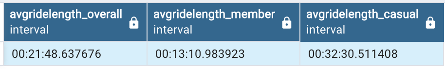

The average ride length or trip duration for casual riders is 32:30 minutes while for the members is 13:10 minutes.

### MAX ride length

**MAX Ride Length**

Use the SQL statement below to compute the maximum ride length or trip duration (member/casual).

<details><summary>Code example</summary>

```sql
SELECT 
    member_casual,
    MAX(ride_length) AS ride_length_MAX
FROM 
    tripdata
GROUP BY 
    member_casual
ORDER BY 
    ride_length_MAX DESC
LIMIT 2
```

</details>


The maximum ride length or trip duration for casual riders is 38 days 20:24:09 hours while for the members is 1 day 55:38 minutes.

### Total trips

**Total trips**

We’ll calculate for annual members and casual riders. We’ll also calculate percentages of overall total for both types:

```sql
SELECT 
member_casual AS bike_user_type, 
count(ride_id) AS count_user_type, 
ROUND(count(ride_id)*100.00 / (SELECT count(ride_id) FROM tripdata),2) as percentage FROM tripdata
GROUP BY member_casual
```

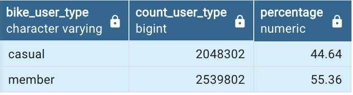

### Median ride length  or trip duration

**Median ride length  or trip duration**

```sql
SELECT member_casual,
PERCENTILE_CONT(0.50) WITHIN GROUP (ORDER BY trip_duration) AS median
FROM tripdata member_casual
GROUP BY member_casual
```

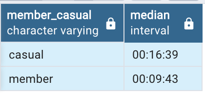

### Busiest day for rides

**Busiest day for rides**

See which day has the most rides for annual members and casual riders.

<details><summary>Code example</summary>

```sql
SELECT
        member_casual, 
        day_of_week AS mode_day_of_week 
FROM 
        (
        SELECT
                DISTINCT member_casual, day_of_week, ROW_NUMBER() OVER (PARTITION BY member_casual ORDER BY COUNT(day_of_week) DESC) rn
        FROM
                tripdata
        GROUP BY
                member_casual, day_of_week
        ) as foo
WHERE
        rn = 1
ORDER BY
        member_casual DESC LIMIT 2
```

</details>


### Median ride length per day

**Median ride length per day**

```sql
SELECT 
member_casual, day_of_week,
PERCENTILE_CONT(0.50) WITHIN GROUP (ORDER BY trip_duration) AS median_trip_duration
FROM tripdata
WHERE member_casual = 'casual'               
GROUP BY member_casual, day_of_week
ORDER BY median_trip_duration DESC LIMIT 7
```

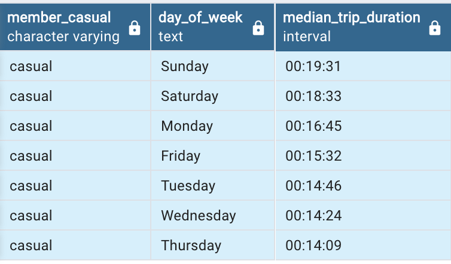

```sql
SELECT 
member_casual, day_of_week,
PERCENTILE_CONT(0.50) WITHIN GROUP (ORDER BY trip_duration) AS median_trip_duration
FROM tripdata
WHERE member_casual = 'member'               
GROUP BY member_casual, day_of_week
ORDER BY median_trip_duration DESC LIMIT 7
```

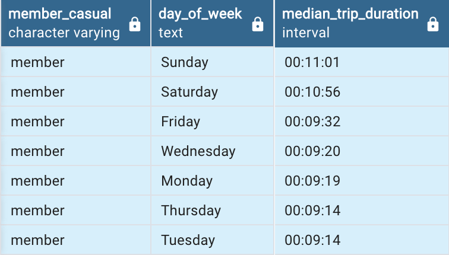

### Total rides per day

**Total rides per day**

Let’s look at total rides per day. We’ll calculate for overall total, annual members and casual riders:

```sql
SELECT  
day_of_week,
COUNT(DISTINCT ride_id) AS TotalTrips,
SUM(CASE WHEN member_casual = 'member' THEN 1 ELSE 0 END) AS MemberTrips,
SUM(CASE WHEN member_casual = 'casual' THEN 1 ELSE 0 END) AS CasualTrips
FROM  tripdata
GROUP BY 1
ORDER BY TotalTrips DESC LIMIT 7
```

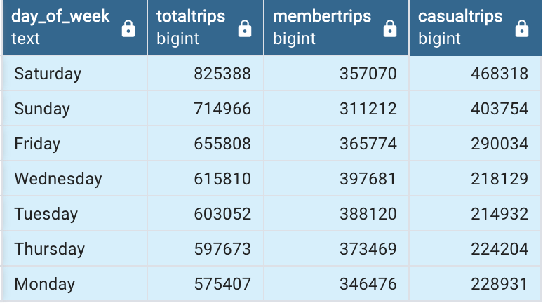

### Average ride_length for users by day_of_week

**Average ride_length for users by day_of_week**

```sql
SELECT  member_casual, day_of_week, AVG(trip_duration)
FROM tripdata
GROUP BY member_casual, day_of_week
```

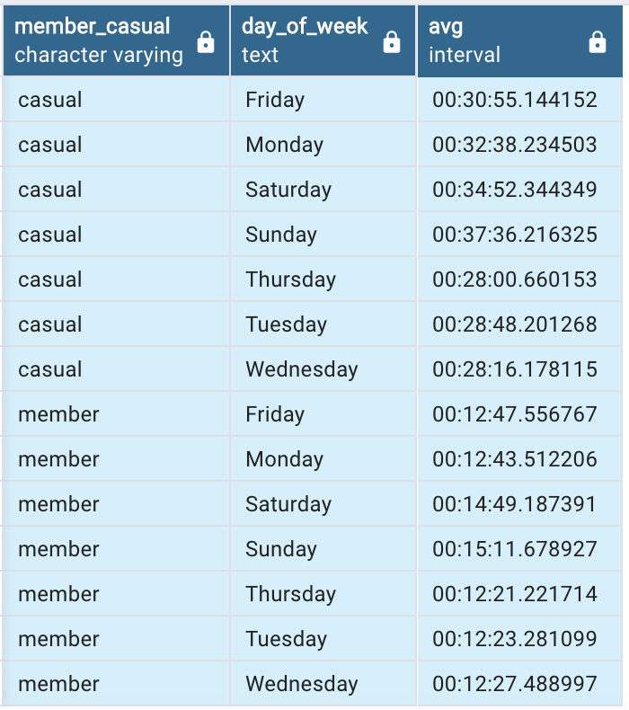

### Number of rides for users by day_of_week

**Number of rides for users by day_of_week**

```sql
SELECT  member_casual, day_of_week, COUNT(DISTINCT ride_id) as number_of_rides
FROM tripdata GROUP BY member_casual, day_of_week
```

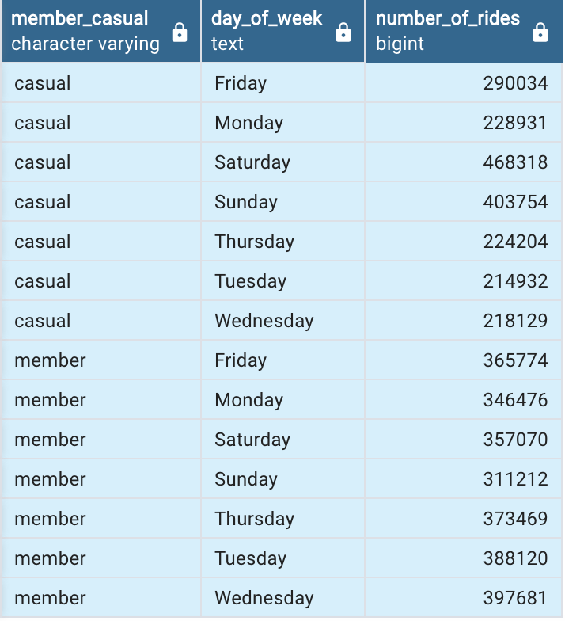

## Share

Visualizations and key findings

### Types of rides

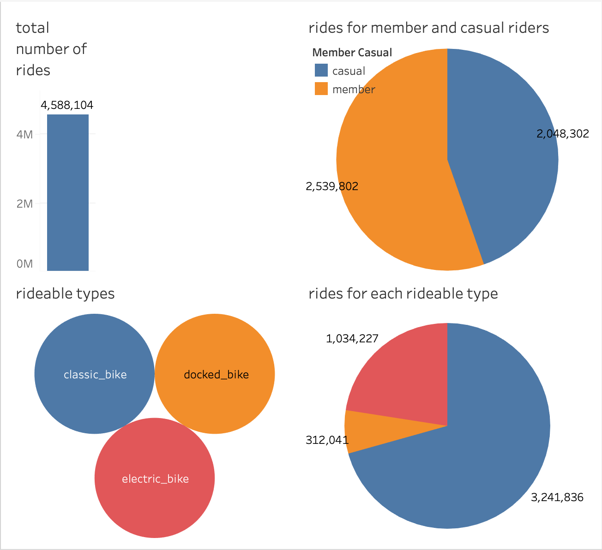

Too many casual riders. Classic bike is commonly used.

### Rides for each week

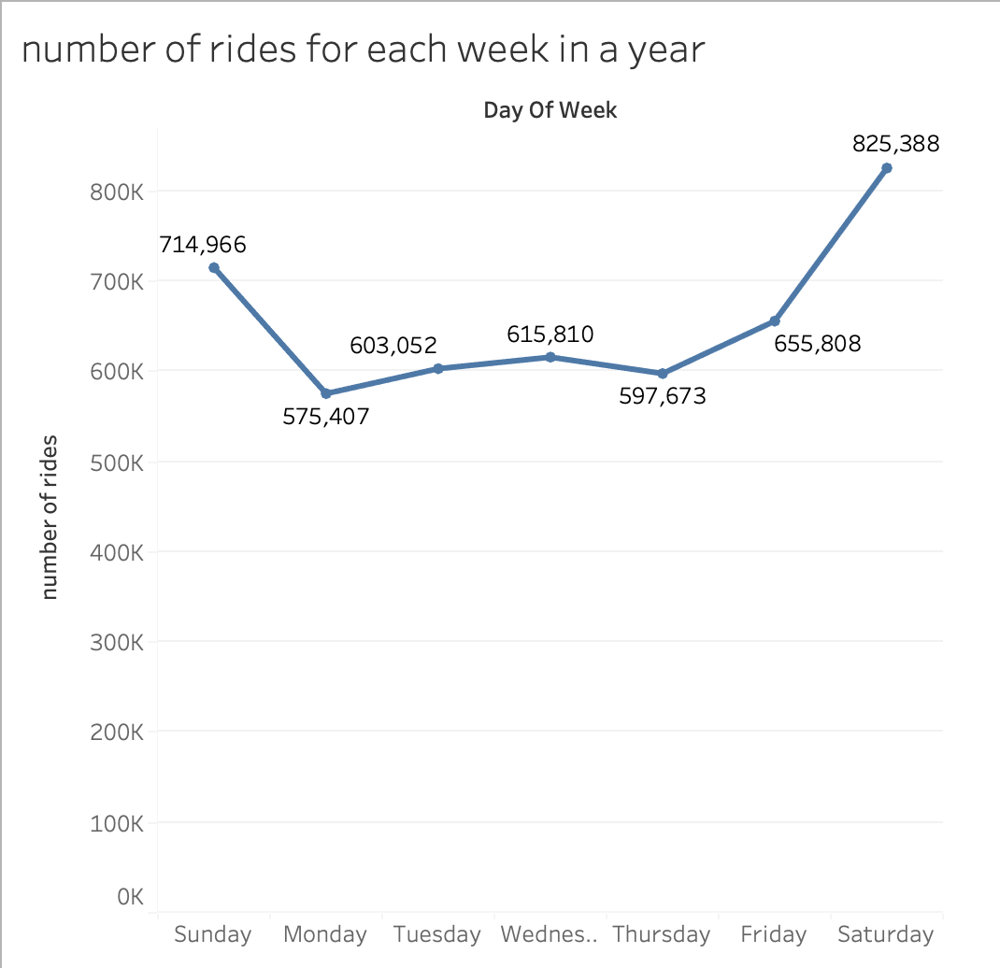

Riders love weekends.

### Rides per month

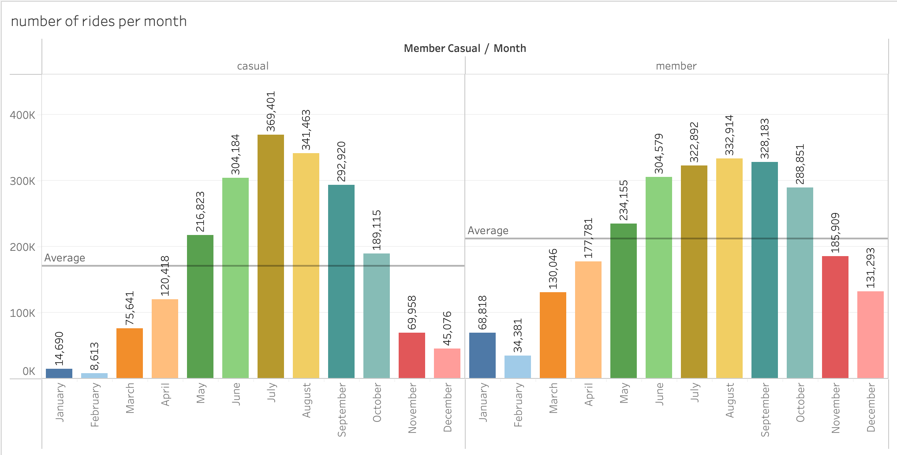

### Monthly average

")

### Weekly average

")

## Three recommendations based on analysis

Casual riders ride longer than members. They also have more rides on weekends than members. Show casual riders why membership is better.

1. Show casual riders how they can save money by purchasing memberships as they ride longer

2. Run marketing campaigns targeting casual riders during weekends

3. Run marketing campaigns targeting casual riders during summer months
