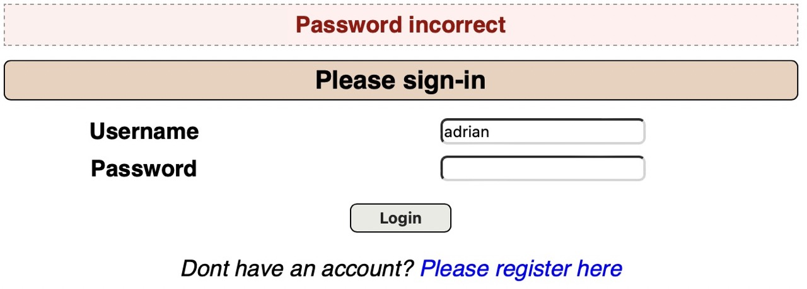

An attacker can determine whether a given username is valid by watching for changes in the website's behavior, a technique known as username enumeration.

This vulnerability is quite simple to exploit. In essence, it's typing usernames into the Username text field and hitting submit to see how the website responds. We can ascertain the existence of that username based on the response from the website.

