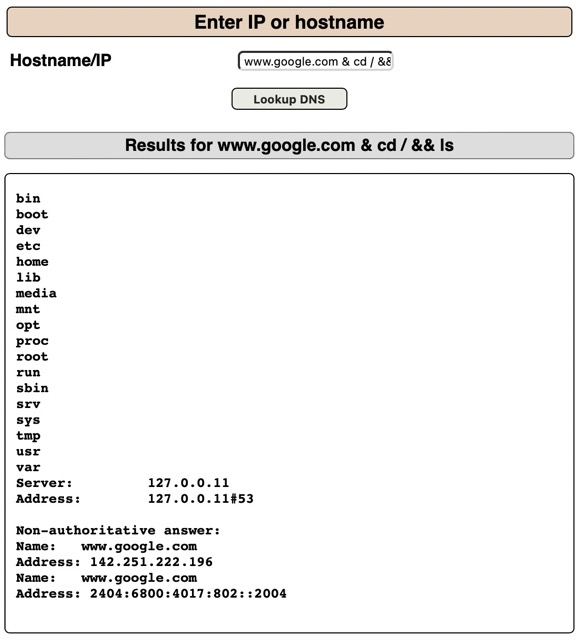
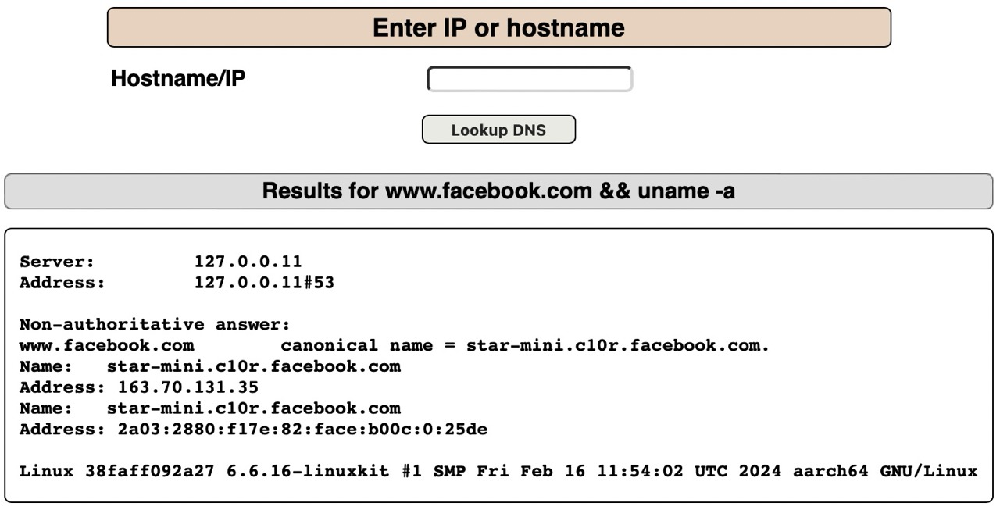

## Target: OWASP Mutillidae II

What is OS command injection?
> " OS command injection is also known as shell injection. It allows an attacker to execute operating system (OS) commands on the server that is running an application, and typically fully compromise the application and its data. Often, an attacker can leverage an OS command injection vulnerability to compromise other parts of the hosting infrastructure, and exploit trust relationships to pivot the attack to other systems within the organization. "

<https://portswigger.net/web-security/os-command-injection>

## ls command

ls is a Linux shell command that lists current directory contents of files and directories. By default, ‘ls’ lists files and directories in alphabetical order.

Type the <www.google.com> && ls. This will search for DNS information for google and will execute the ls command indicating that the site is vunerable to command injection.

The uname -a command will display all system information, including the kernel name, network node hostname, kernel release date, kernel version, machine hardware name, processor type, hardware platform, and operating system.

