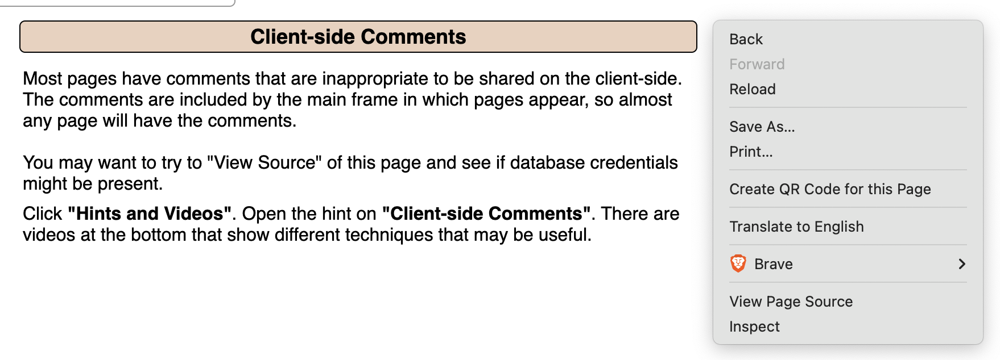

What is sensitive information disclosure vulnerability? When a website inadvertently provides users with sensitive information, this is known as sensitive information disclosure. We'll be demonstrating a hardcoded credentials vulnerability utilizing the Client-side Comments page.

### First, open the Client-side Comments page by navigating to the following location in the menu: HTML/Javascript comments

### Right click, then choose View Page Source

### The hard-coded login credentials are located in a comment at the bottom of the source code-containing page

