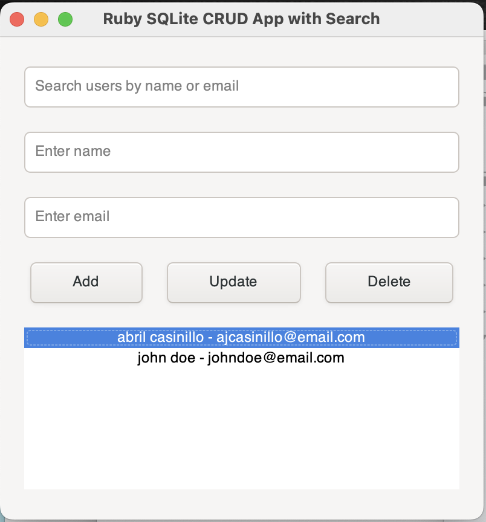

## Ruby GTK (Ruby-GNOME2)

GTK is a powerful cross-platform toolkit for creating graphical user interfaces. Ruby-GNOME2 (now called gtk3 for Ruby) is the Ruby binding for the GTK library.

Features:

    * Extensive widget support.
    * Cross-platform (Linux, macOS, and Windows).
    * Well-documented and widely used.

Installation

```bash
    gem install gtk3    
```
## Ruby GUI CRUD App using gtk3



###  Install the necessary gems:
    gtk3: For building the GUI.
    sqlite3: For managing the SQLite database.

```bash
    gem install gtk3 sqlite3
```

### Build the Application
Below is a simple Ruby script that demonstrates how to create a basic CRUD system for managing records (e.g., user information) with a GUI interface.


```ruby
require 'gtk3'
require 'sqlite3'

# Create or open an SQLite3 database
db = SQLite3::Database.new "test.db"

# Create a simple table if it doesn't already exist
db.execute <<-SQL
  CREATE TABLE IF NOT EXISTS users (
    id INTEGER PRIMARY KEY,
    name TEXT,
    email TEXT
  );
SQL

# GTK Application
class CrudApp
  def initialize
    @builder = Gtk::Builder.new
    create_window
    setup_signals
    @db = SQLite3::Database.new "test.db"
    refresh_users_list
  end

  def create_window
    @window = Gtk::Window.new("Ruby SQLite CRUD App with Search")
    @window.set_size_request(400, 400)
    @window.signal_connect("destroy") { Gtk.main_quit }

    # Create a vertical box layout
    vbox = Gtk::Box.new(:vertical, 10)
    vbox.margin = 20

    # Entry field for search
    @search_entry = Gtk::Entry.new
    @search_entry.placeholder_text = "Search users by name or email"
    @search_entry.signal_connect("changed") { search_users }  # Trigger search on input change
    vbox.pack_start(@search_entry, expand: false, fill: true, padding: 5)

    # Entry fields for name and email
    @name_entry = Gtk::Entry.new
    @name_entry.placeholder_text = "Enter name"
    vbox.pack_start(@name_entry, expand: false, fill: true, padding: 5)

    @email_entry = Gtk::Entry.new
    @email_entry.placeholder_text = "Enter email"
    vbox.pack_start(@email_entry, expand: false, fill: true, padding: 5)

    # Buttons for CRUD operations
    hbox = Gtk::Box.new(:horizontal, 10)
    
    add_button = Gtk::Button.new(label: "Add")
    add_button.signal_connect("clicked") { add_user }
    hbox.pack_start(add_button, expand: true, fill: true, padding: 5)
    
    update_button = Gtk::Button.new(label: "Update")
    update_button.signal_connect("clicked") { update_user }
    hbox.pack_start(update_button, expand: true, fill: true, padding: 5)
    
    delete_button = Gtk::Button.new(label: "Delete")
    delete_button.signal_connect("clicked") { delete_user }
    hbox.pack_start(delete_button, expand: true, fill: true, padding: 5)

    vbox.pack_start(hbox, expand: false, fill: true, padding: 5)

    # Create a grid to hold the column labels and user list
    grid = Gtk::Grid.new
    grid.row_spacing = 10
    grid.column_spacing = 20

    # Column labels
    name_label = Gtk::Label.new("Name")
    email_label = Gtk::Label.new("Email")
    name_label.set_xalign(0)  # Align labels to the left
    email_label.set_xalign(0)
    
    # Add column labels to the grid
    grid.attach(name_label, 0, 0, 1, 1)
    grid.attach(email_label, 1, 0, 1, 1)

    # Listbox for displaying users
    @listbox = Gtk::ListBox.new
    grid.attach(@listbox, 0, 1, 2, 1)  # Listbox spans across both columns

    vbox.pack_start(grid, expand: true, fill: true, padding: 5)

    # Add the layout to the window
    @window.add(vbox)
    @window.show_all
  end

  def setup_signals
    @window.signal_connect("destroy") { Gtk.main_quit }
  end

  def add_user
    name = @name_entry.text
    email = @email_entry.text

    if name.empty? || email.empty?
      show_message("Name and Email cannot be empty!")
      return
    end

    @db.execute("INSERT INTO users (name, email) VALUES (?, ?)", [name, email])
    refresh_users_list
    clear_entries
  end

  def update_user
    selected_row = @listbox.selected_row
    return unless selected_row

    user_id = selected_row.instance_variable_get(:@user_id)
    name = @name_entry.text
    email = @email_entry.text

    if name.empty? || email.empty?
      show_message("Name and Email cannot be empty!")
      return
    end

    @db.execute("UPDATE users SET name = ?, email = ? WHERE id = ?", [name, email, user_id])
    refresh_users_list
    clear_entries
  end

  def delete_user
    selected_row = @listbox.selected_row
    return unless selected_row

    user_id = selected_row.instance_variable_get(:@user_id)
    @db.execute("DELETE FROM users WHERE id = ?", [user_id])
    refresh_users_list
    clear_entries
  end

  def search_users
    search_query = @search_entry.text.downcase
    return refresh_users_list if search_query.empty?  # Reset list if search is empty

    @listbox.each { |child| @listbox.remove(child) }  # Clear current list

    # Query the database for matching users based on search query (name or email)
    @db.execute("SELECT * FROM users WHERE LOWER(name) LIKE ? OR LOWER(email) LIKE ?", ["%#{search_query}%", "%#{search_query}%"]) do |row|
      list_row = Gtk::ListBoxRow.new
      list_row.instance_variable_set(:@user_id, row[0])  # Save user id for update/delete actions
      row_box = Gtk::Box.new(:horizontal, 20)
      
      name_label = Gtk::Label.new(row[1])
      name_label.set_xalign(0)
      email_label = Gtk::Label.new(row[2])
      email_label.set_xalign(0)

      row_box.pack_start(name_label, expand: true, fill: true, padding: 10)
      row_box.pack_start(email_label, expand: true, fill: true, padding: 10)
      
      list_row.add(row_box)
      @listbox.add(list_row)
    end

    @listbox.show_all
  end

  def refresh_users_list
    @listbox.each { |child| @listbox.remove(child) }  # Clear current list

    @db.execute("SELECT * FROM users") do |row|
      list_row = Gtk::ListBoxRow.new
      list_row.instance_variable_set(:@user_id, row[0])  # Save user id for update/delete actions
      row_box = Gtk::Box.new(:horizontal, 20)
      
      name_label = Gtk::Label.new(row[1])
      name_label.set_xalign(0)
      email_label = Gtk::Label.new(row[2])
      email_label.set_xalign(0)

      row_box.pack_start(name_label, expand: true, fill: true, padding: 10)
      row_box.pack_start(email_label, expand: true, fill: true, padding: 10)

      list_row.add(row_box)
      @listbox.add(list_row)
    end

    @listbox.show_all
  end

  def clear_entries
    @name_entry.text = ''
    @email_entry.text = ''
  end

  def show_message(message)
    dialog = Gtk::MessageDialog.new(
      parent: @window,
      flags: :destroy_with_parent,
      type: :info,
      buttons_type: :close,
      message: message
    )
    dialog.run
    dialog.destroy
  end
end

# Run the application
app = CrudApp.new
Gtk.main
```
